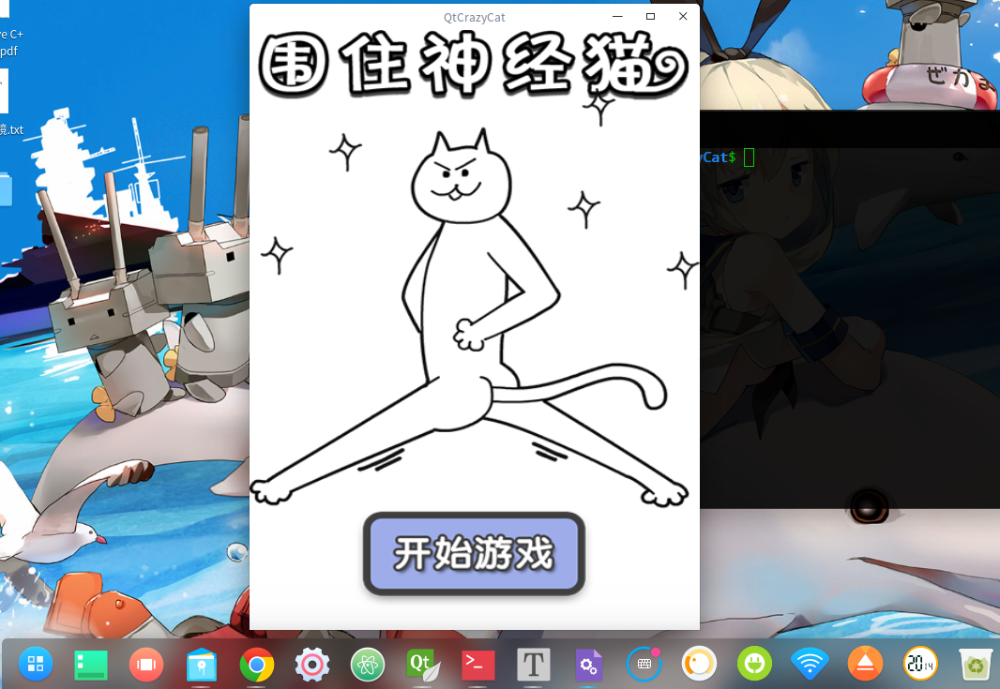

# QtCrazyCat

## 1. 开发环境

os: windows和linux(都测试过)

Qt：开发语言(c++, qml)

## 2. 软件简介

软件英文叫: CrazyCat , 中文叫围住神经病的猫，是一款较好玩的游戏。实现也很容易，猫的走法算法比较简单，有兴趣可以自己修改，代码大概300+行

## 3. 效果测试

### 3.1 window

### 3.2 linux

